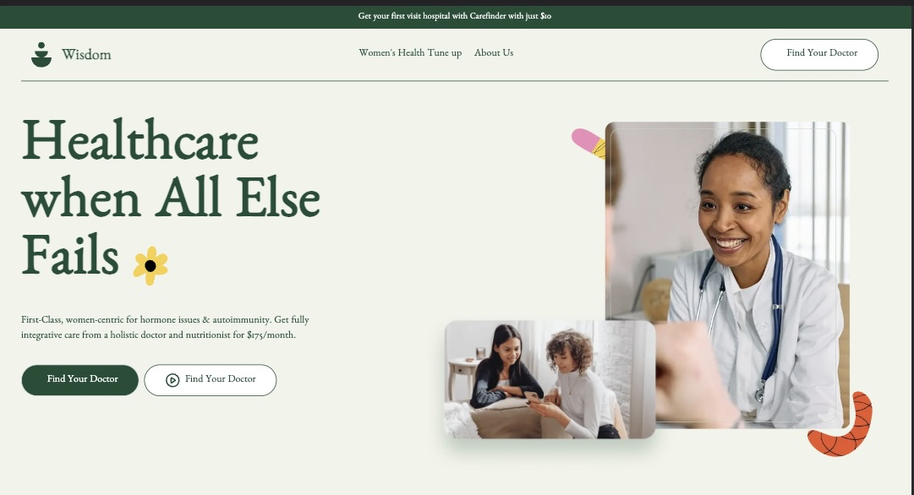

# AltSchool Frontend Capstone Project

Hi There! 🙋‍♀️ \
This is my capstone project submission - Carefinder app.
Carefinder allows users to search for hospitals within their region. Users can input their location or select from a list of nearby cities to find hospitals in their area. The platform will provide a list of hospitals and their respective contact details, including address, phone number, and email.


# Technologies 

 + [JavaScript](https://javascript.info/) 
 + [ReactJs](https://react.dev/) 
 + [NextJs](https://nextjs.org/)
 + [Netlify](https://www.netlify.com/) 
 + [Firebase](https://firebase.google.com/) 
 + [Github Actions](https://docs.github.com/en/actions/)
 + [React Hook-form](https://react-hook-form.com/) 
 + [TailwindCss](https://tailwindcss.com/) 
 + [Typescript](https://www.typescriptlang.org/) 


# Prototype

 
# How to Contribute

Want to contribute?

1. Clone the repository 
$ git clone [https://github.com/Dunni0/Carefinder-App](https://github.com/Dunni0/Carefinder-App)

2. Change directory into the cloned folder and run the setup script
$ cd carefinder-app

3. Open your terminal and type this command `yarn add ` or `npm install` to add the vue dependency to the app in the development mode.

4. Then after the installation of the  dependency type this command  `yarn dev` to run the app in your local environment 

5. Copy this link [http://localhost:3000/](http://localhost:3000/) and paste it to your web browser(Chrome, safari, mozilla firefox et.c) to view it.


# Deployment
Netlify was used to deploy the app. 
 + [Netlify](https://www.netlify.com/)
 
 ```

1. A link to the project repository  https://github.com/Dunni0/Carefinder-App

2. A publicly live hosted URL of the project https://subtle-panda-a3400b.netlify.app/

```

# License
The MIT License - Copyright (c) 2023 - Present, rasheed-olatunde altschool capstone project/  Storage Service.

# Author
Awonuga Oluwapelumi
